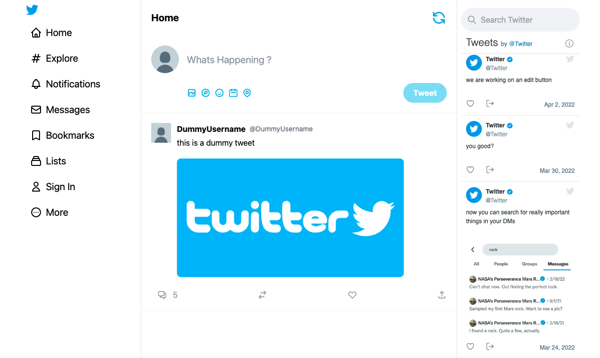
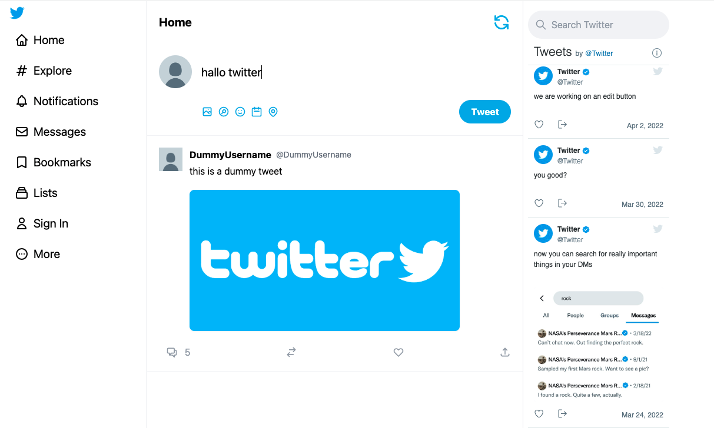
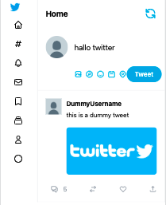
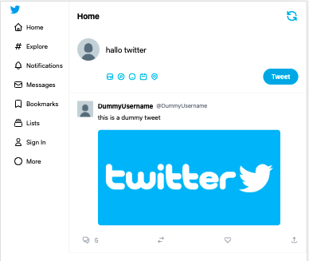

# Twitter 2 Clone
> Outline a brief description of your project.

## Table of Contents
* [Setup](#setup)
* [Usage](#usage)
* [Project Status](#project-status)
* [Room for Improvement](#room-for-improvement)
* [Contact](#contact)
<!-- * [License](#license) -->

## General Information
- Simple UI clone twitter 2 with React, Next.js with TailWindCss
- This App used to learn how to tailwind css used and next js
- implement my own learning about typescript
<!-- You don't have to answer all the questions - just the ones relevant to your project. -->

## Preview Web Screenshot

## Preview Web Screenshot responsive mobile & Tab design

## Technologies Used
- React
- Next Js
- Tailwind Css
- HeroIcons
- React-twitter-embed
- Typescript

## Features
List the ready features here:
- User Inteface
- Responsive web to mobile design
- User Register (up coming

## Setup
cd projectName 
npm install
Run npm run dev

## Usage
Open localhost:3000

`write-your-code-here`
## Project Status
Project is: _in progress_ (still need improvement)

## Room for Improvement
Improvement

Room for improvement:
- Adding Sanity to add CRUD Features
- Implement graphQl for backend
- adding login / register

To do:
- Implement of Sanity for backend services or graphQl Services
- Adding Image Upload for profile
- Adding login / Register

## Acknowledgements
Give credit here.
- This project was inspired by Developer Sonny Sangha Youtube Channel
- Hopefully open for someone can go branch and do PR for this repository

## Resource 
- [https://rnfirebase.io/database/usage](https://www.youtube.com/watch?v=rCselwxbUgA)
- [https://rnfirebase.io/](https://nextjs.org/docs)
- https://heroicons.com/
- https://tailwindcss.com/
- https://www.sanity.io/

<!-- Optional -->
<!-- ## License -->
<!-- This project is open source and available under the [... License](). -->

<!-- You don't have to include all sections - just the one's relevant to your project -->
